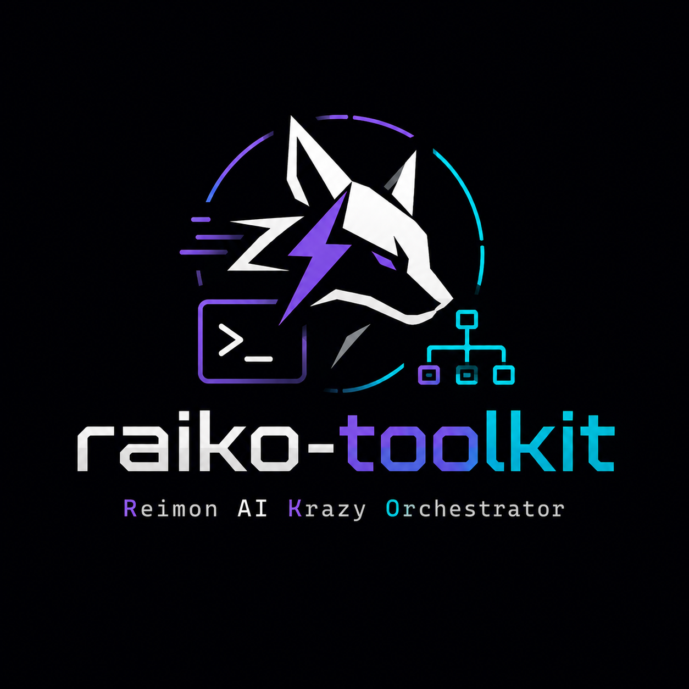
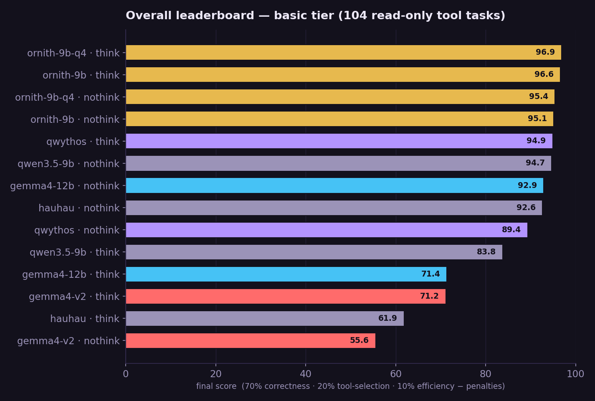
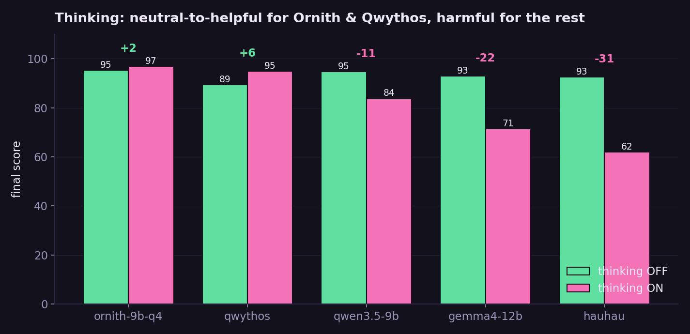
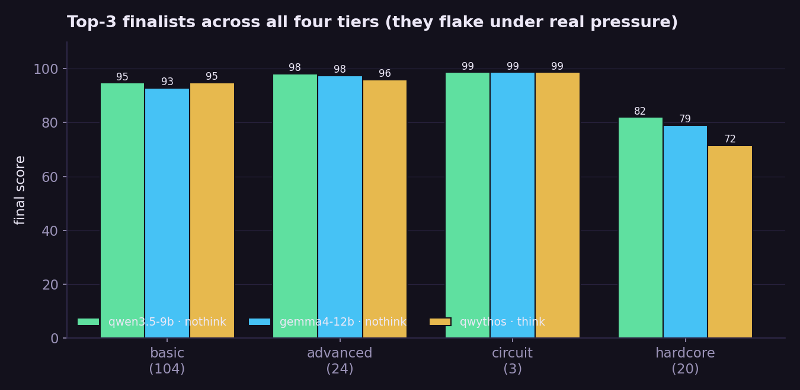

<div align="center">



**R**eimon **A**I **K**razy **O**rchestrator — a local-first, multi-provider LLM agent toolkit.


</div>

---

A tool-using agent you can point at **anything** — your own GGUF models on the GPU via
`llama.cpp`, a remote llama-server, or the big cloud APIs (OpenAI, Anthropic, xAI,
OpenRouter, nano-gpt) — wrapped in a polished terminal UI, backed by a portable tool
layer, an **MCP tool server with a web backoffice**, and a rigorous **tool-calling
benchmark** that decides which local model is actually worth running.

---

## ✨ Highlights

| | |
|---|---|
| 🖥️ **Multi-provider TUI** | One wizard, 7 providers: `nano-gpt`, **local llama.cpp** (your GPU), **remote llama.cpp** (enter a URL), `OpenAI`, `Anthropic`, `xAI`, `OpenRouter`. |
| 📊 **Live telemetry** | In local mode, real-time GPU-util sparkline + VRAM/CPU/RAM bars + temp/power/tok-s, straight from `nvidia-smi` + `psutil`. |
| 🧩 **Clean widget chat** | opencode/Claude-Code-style: box-less message widgets, inline dim thinking (collapsible), compact colored tool bullets + inline diffs, and an animated "working" bar (spinner + wiggling wave + elapsed/tok·s) while the model runs. |
| 🔐 **Permission gating** | Claude-Code-style allow/always/deny prompts for flagged operations (`--dangerously-skip-permissions` to opt out). |
| 🛰️ **MCP tool server** | Serve the whole toolset over MCP (`/mcp`) with a web **backoffice** to enable/disable tools and author custom shell tools — no redeploy of the agent. |
| 🏁 **Decisive benchmark** | 4 tiers, deterministic decoding, programmatic graders, resumable runs, and a leaderboard that tells you which model to burn your VRAM on. |
| ⚙️ **Zero hardcoded secrets** | Every key/path/host lives in gitignored local config; the repo ships with safe placeholders and `*.example.json` templates. |

---

## 🏗️ Architecture


---

## 🖥️ The TUI — `tui.py`

A [Textual](https://textual.textualize.io/) app. Launch it and a startup wizard walks you
through **provider → model → context**:

```bash
python tui.py                       # interactive wizard
python tui.py --provider local --model qwen35-9b
python tui.py --dangerously-skip-permissions
```

- **Provider wizard** with back-navigation, last-used highlighting, and per-provider
  **favorites** (`f`).
- **Remote llama.cpp**: pick it, paste a URL, and it lists the served models.
- **API-key prompt**: choose a cloud provider with no key on file and it asks for one
  (saved to `tui_config.json`).
- **Local mode**: computes the optimal `ctx-size` for your GPU (overridable), **starts the
  llama-server only if it isn't already running**, and stops it on exit.
- **Sessions**: conversations are auto-saved per turn and linked to their model. On
  startup, if you have saved sessions, a **Continue / New** menu lets you resume one
  (history replayed into the log); pick it from a list, or delete with `d`.
- **Model swap (`F3`)**: switch model mid-conversation on cloud/remote providers
  (nano · OpenAI · Anthropic · xAI · OpenRouter · remote llama.cpp) — history is kept.
  Not available in local mode (one model per llama-server).
- **System prompt presets (`F6`)**: named personas in `tui_config.json`
  (`system_prompts`); pick/edit/save one and it applies live (next turn) and persists to
  the session. New sessions use `active_system_prompt`; you can also set it **before** a
  session from the startup wizard (`Ctrl+P`), and with >1 preset a picker appears at
  session start. The fixed tool-calling rules are always appended so a custom persona
  can't break tool use.
- **Multiline input + history**: a composer where **Enter** sends and **Shift+Enter** /
  **Ctrl+J** insert newlines (paste code freely); **↑/↓** recall previous prompts.
- **Interrupt (`Esc`)**: stop a running turn mid-stream — partial output is kept.
- **Diff view**: `write_file` / `edit_file` render a colored before→after diff of the change.
- **Compaction**: when the context fills up the older turns are auto-summarized
  (`auto_compact` in config, threshold ~85%); run it anytime with `/compact`.
- **Settings (`F2`)**: open and edit `tui_config.json` in-app, with JSON validation.
- **Slash commands**: `/clear` (reset the conversation) · `/compact` (summarize older
  turns) · `/system` (prompt editor) · `/tools` (tool log) · `/help`. Typing `/` pops a
  filterable command menu above the input (↑/↓ to move, Tab to complete, Enter to run).
- **MCP routing**: remote tools are auto-discovered and exposed with a `mac_` prefix.

There's also a headless agent loop in **`agent.py`** (same providers via env vars) for
scripting:

```bash
AGENT_PROVIDER=llamacpp AGENT_BASE_URL=http://localhost:25565/v1 \
AGENT_API_KEY=sk-noop AGENT_MODEL=qwen35-9b python agent.py
```

---

## 🧰 Tools — `tools.py`

A portable, stdlib-only tool layer shared by the TUI, the agent, and the MCP server.

**Read-only:** `read_file` · `list_dir` · `get_current_directory` · `grep` · `find_files`
· `read_lines` · `head` · `tail` · `count_lines` · `stat_path` · `tree` · `find_in_files`

**Write / execute (gated):** `write_file` · `edit_file` · `run_python` · `run_powershell`
· `run_bash` · `vault_get_secret`

**Web:** `web_search` — Tavily ranked results + synthesized answer · `web_fetch` — read
a page's full text (Tavily Extract). Set `tavily_api_key` in `tui_config.json` (or the
`TAVILY_API_KEY` env var); both are also exposed over the MCP server.

Execution tools run in a subprocess with **timeouts** and a **denylist** that blocks only
genuinely destructive operations (`rm -rf`, `format`, `shutdown`, registry edits); normal
subprocess/network use is allowed. Anything flagged triggers a permission prompt in the TUI.

> Host-specific capabilities (e.g. operating a remote Mac) are **not** shipped here — the
> agent reaches them through the MCP server, whose file/shell tools already run on that host.

---

## 🛰️ MCP server + backoffice — `mcp_server/server.py`

Exposes the toolset over the **Model Context Protocol** (streamable-HTTP) and serves a web
**backoffice** to manage it live.

```bash
python mcp_server/server.py --http --port 8765
#   MCP endpoint  →  http://<host>:8765/mcp
#   Backoffice    →  http://<host>:8765/
```

The backoffice lets you **enable/disable** any tool, see the **full description the model
receives**, and author **custom shell tools** (`name + description + command with {args}`) —
it saves to `tools_config.json` and hot-restarts the server. Point the TUI at it via the
`mcp` section of `tui_config.json`.

---

## 🏁 Benchmark harness — `bench/`

A decisive, reproducible tool-calling benchmark for local GGUF models. Deterministic
decoding (`temperature=0, seed=42`), **programmatic graders** (no vibes), **resumable**
runs (per-task JSONL + fsync), thinking **ON/OFF** per model, and a weighted leaderboard
(`70% correctness · 20% tool-selection · 10% efficiency − penalties`).

Each tier now ships **≥200 tasks** (basic 202 · advanced 214 · hardcore 201 · circuit 203).
The basic/advanced/hardcore graders are correct-by-construction — every expected answer is
computed from the same fixture data the sandbox is built from. The circuit tier is mostly
**local Vault retrieval** (200 seeded KV secrets read back) plus a few **real Mac SSH
copies**, which stay few on purpose since they hit live infra.

```bash
python bench/run_bench.py            # basic tier (read-only tools)
python bench/run_adv.py              # advanced: write/edit/python/powershell
python bench/run_circuit.py          # circuit: Vault secret → remote copy
python bench/run_hard.py             # hardcore: real dev/sysadmin incidents
```

It serves one model at a time (auto `--jinja`, kills between runs so VRAM never stacks),
and any model is one line in `bench/models.json`.

### Overall leaderboard — basic tier (read-only tool tasks)

> The charts below predate the expansion to ≥200 tasks/tier; rerun the suite to refresh them.



### The key finding: thinking is not free

Enabling the model's own "thinking" is **neutral-to-helpful for Ornith and the Mythos
merge, but hurts every other model** — sometimes badly (Gemma loses ~21 pts, the Hauhau
merge ~31).



### Champion vs. the field, across tiers

The interesting tier is **hardcore** (real multi-step dev/sysadmin incidents) — that's
where most models flake. Ornith doesn't.



> **Verdict:** **`Ornith-1.0-9B` (Q4_K_M) is the new overall #1.** A 9B model that tops the
> basic tier (96.9), stays top-tier on advanced (97.5), and **runs away with hardcore
> (94.3 — the best score the benchmark has ever recorded**, vs the prior best of 82.0), all
> while being fast and token-efficient. Uniquely, thinking doesn't hurt it. `qwen3.5-9b`
> (nothink) and `gemma4-12b` (nothink) are the next best all-rounders.
>
> Two finetunes tested and **rejected**: `gemma4-v2` ("agentic-fable5" tune) regressed hard
> — it collapses on the hardcore tier (40.6 / 30% correct vs base Gemma's 79.0) and is slow
> and hyper-verbose. The `Q3_K_M` of Ornith also scores a touch below the `Q4_K_M` (esp. on
> hardcore: 86.7 → 94.3), so use the Q4 if it fits your VRAM.

Regenerate the charts after a new run:

```bash
python bench/make_charts.py          # needs matplotlib
```

---

## 🚀 Quickstart

```bash
git clone <your-fork-url> raiko-toolkit && cd raiko-toolkit
python -m venv .venv && .venv\Scripts\activate        # Windows
pip install -r requirements.txt

# create your local config from the templates (these are gitignored)
copy tui_config.example.json tui_config.json          # add your API keys
copy bench\models.example.json bench\models.json       # add your .gguf paths

python tui.py
```

> **Local llama.cpp** needs [`llama-server`](https://github.com/ggml-org/llama.cpp) built
> with tool support; the benchmark launches it with `--jinja` (required for tool-calling).

---

## 🔧 Configuration (all gitignored)

| File | What it holds | Template |
|---|---|---|
| `tui_config.json` | Provider base-urls, **API keys**, default model, MCP url, favorites | `tui_config.example.json` |
| `bench/models.json` | `llama-server` path, models folder, one entry per GGUF model | `bench/models.example.json` |
| `mcp_server/tools_config.json` | Enabled/disabled tools + custom shell tools | *(auto-created)* |
| `mac-credentials.txt` | (optional, benchmark only) `user:pass` + host for the circuit tier | — |

No secrets, keys, IPs, or machine-specific paths live in the source — only in these files.

---

## 📂 Layout

```
raiko-toolkit/
├─ tui.py              # Textual TUI (multi-provider, telemetry, MCP routing)
├─ agent.py           # headless agent loop (same providers via env)
├─ tools.py           # portable read-only + execution tool layer
├─ context.py         # token / context-window tracker
├─ mcp_client.py      # MCP client (loads remote tools into the agent)
├─ mcp_server/        # FastMCP server + web backoffice
├─ bench/             # benchmark harness, tiers, graders, charts
└─ assets/            # README charts
```
