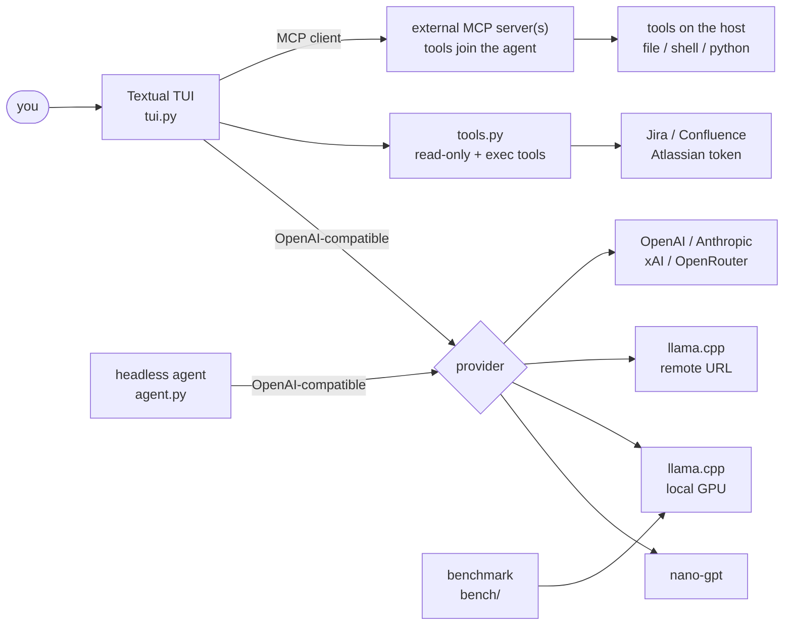

<div align="center">


**R**eimon **A**I **K**razy **O**rchestrator — a local-first, multi-provider LLM agent toolkit.


</div>

---

A tool-using agent you can point at **anything** — your own GGUF models on the GPU via
`llama.cpp`, a remote llama-server, or the big cloud APIs (OpenAI, Anthropic, Google Gemini, xAI,
OpenRouter, nano-gpt) — wrapped in a polished terminal UI, backed by a portable tool
layer, an **MCP client** (plug in any MCP server), and a rigorous **tool-calling
benchmark** that decides which local model is actually worth running.

---

## ✨ Highlights

| | |
|---|---|
| 🖥️ **Multi-provider TUI** | One wizard, 9 providers: `nano-gpt`, **local llama.cpp** (your GPU), **remote llama.cpp** / **vLLM** (enter a URL), `OpenAI`, `Anthropic`, `Gemini`, `xAI`, `OpenRouter`. |
| 📊 **Live telemetry** | In local mode, real-time GPU-util sparkline + VRAM/CPU/RAM bars + temp/power/tok-s, straight from `nvidia-smi` + `psutil`. |
| 🧩 **Clean widget chat** | opencode/Claude-Code-style: box-less message widgets, inline dim thinking (collapsible), compact colored tool bullets + inline diffs, and an animated "working" bar (spinner + wiggling wave + elapsed/tok·s) while the model runs. |
| 🔐 **Scoped permissions** | Allow/always/deny prompts for flagged ops — **Always-allow persists per tool** to a config allowlist (not a global switch). `write_file`/`edit_file` are **confined to a workspace** dir; writes outside it prompt. `--dangerously-skip-permissions` opts out. |
| 🪐 **Atlassian integration** | Search, read and — behind a permission prompt — write **Jira** issues (`jira_search`/`jira_get`/`jira_assign`/`jira_comment`) and **Confluence** pages (`confluence_search`/`confluence_get`/`confluence_create`/`confluence_comment`), all sharing one Atlassian API token. |
| 🔌 **MCP client** | Plug raiko into any external MCP server(s) — their tools join the agent name-prefixed, routed back to the right server. You curate which servers, so no tool-list bloat. |
| 🏁 **Decisive benchmark** | 4 tiers, deterministic decoding, programmatic graders, resumable runs, and a leaderboard that tells you which model to burn your VRAM on. |
| ⚙️ **Zero hardcoded secrets** | Every key/path/host lives in gitignored local config; the repo ships with safe placeholders and `*.example.json` templates. |

---

## 🏗️ Architecture



---

## 🖥️ The TUI — `tui.py`

A [Textual](https://textual.textualize.io/) app. Launch it and a startup wizard walks you
through **provider → model → context**:

```bash
python tui.py                       # interactive wizard
python tui.py --provider local --model qwen35-9b
python tui.py --dangerously-skip-permissions
```

- **Provider wizard** with back-navigation, last-used highlighting, and per-provider
  **favorites** (`f`).
- **Remote llama.cpp**: pick it, paste a URL, and it lists the served models.
- **API-key prompt**: choose a cloud provider with no key on file and it asks for one
  (saved to `tui_config.json`).
- **Local mode**: computes the optimal `ctx-size` for your GPU (overridable), **starts the
  llama-server only if it isn't already running**, and stops it on exit.
- **Sessions**: conversations are auto-saved per turn and linked to their model. On
  startup, if you have saved sessions, a **Continue / New** menu lets you resume one
  (history replayed into the log); pick it from a list, or delete with `d`.
- **Model swap (`F3`)**: switch model mid-conversation on cloud/remote providers
  (nano · OpenAI · Anthropic · Gemini · xAI · OpenRouter · remote llama.cpp · vLLM) — history is kept.
  Not available in local mode (one model per llama-server).
- **System prompt presets (`F6`)**: named personas in `tui_config.json`
  (`system_prompts`); pick/edit/save one and it applies live (next turn) and persists to
  the session. New sessions use `active_system_prompt`; you can also set it **before** a
  session from the startup wizard (`Ctrl+P`), and with >1 preset a picker appears at
  session start. The fixed tool-calling rules are always appended so a custom persona
  can't break tool use.
- **Multiline input + history**: a composer where **Enter** sends and **Shift+Enter** /
  **Ctrl+J** insert newlines (paste code freely); **↑/↓** recall previous prompts.
- **Interrupt (`Esc`)**: stop a running turn mid-stream — partial output is kept.
- **Diff view**: `write_file` / `edit_file` render a colored before→after diff of the change.
- **Compaction**: when the context fills up the older turns are auto-summarized
  (`auto_compact` in config, threshold ~85%); run it anytime with `/compact`.
- **Retry / edit / export**: `/retry` regenerates the last response, `/edit` rewinds to
  your last message and drops it in the composer to tweak and resend, and `/export` writes
  the whole conversation to a Markdown file.
- **Cost & budget**: live USD estimate per turn + session total in the status bar
  (provider-reported when available — nano-gpt/OpenRouter — else from a price table you
  can override via `pricing`; self-hosted is free). Set `budget_usd` to cap a session — it
  warns as you approach it and blocks new turns once exceeded (`/clear` resets the tally).
- **Scoped permissions + workspace** (`/permissions`): flagged ops prompt allow / **always /
  deny; "always" persists that tool** to `permissions.allow` in config (deny-list too), so
  trust survives restarts without a global skip. `write_file`/`edit_file` are **confined to
  `permissions.workspace`** (default: the launch dir) — writing outside it triggers a prompt.
- **Settings (`F2`)**: open and edit `tui_config.json` in-app, with JSON validation.
- **Setup wizard (`/configure`, `--configure`, or first run)**: a guided screen for
  provider keys, Jira/Confluence and MCP, with live **Validate** and a safe **Save** (a
  blank field never clears an existing value). It also has **optional one-click downloads**:
  the Jira CLI + Vault binaries, and **llama-server auto-matched to your machine** (detects
  OS/arch + CUDA and grabs the right llama.cpp build) — or just skip them.
- **Slash commands**: `/clear` (reset) · `/compact` (summarize older turns) · `/retry`
  (regenerate) · `/edit` (edit & resend) · `/export` (to Markdown) · `/system` (prompt
  editor) · `/tools` (tool log) · `/configure` (setup wizard) · `/permissions` (allow/deny
  + workspace) · `/help`. Typing `/` pops a filterable command menu above the input (↑/↓ to
  move, Tab to complete, Enter to run).
- **MCP client**: attach external MCP servers in config; their tools are discovered on startup and exposed name-prefixed per server.

There's also a headless agent loop in **`agent.py`** (same providers via env vars) for
scripting:

```bash
AGENT_PROVIDER=llamacpp AGENT_BASE_URL=http://localhost:25565/v1 \
AGENT_API_KEY=sk-noop AGENT_MODEL=qwen35-9b python agent.py
```

---

## 🧰 Tools — `tools.py`

A portable, stdlib-only tool layer shared by the TUI and the headless agent.

**Read-only:** `read_file` · `list_dir` · `get_current_directory` · `grep` · `find_files`
· `read_lines` · `head` · `tail` · `count_lines` · `stat_path` · `tree` · `find_in_files`

**Write / execute (gated):** `write_file` · `edit_file` · `run_python` · `run_powershell`
· `run_bash` · `vault_get_secret`

**Web:** `web_search` — Tavily ranked results + synthesized answer · `web_fetch` — read
a page's full text (Tavily Extract). Set `tavily_api_key` in `tui_config.json` (or the
`TAVILY_API_KEY` env var).

**Jira:** `jira_search` — find issues by free text or raw JQL · `jira_get` — fetch one
issue by key · `jira_assign` — (re)assign an issue · `jira_comment` — post a comment. All
shell out to the [`ankitpokhrel/jira-cli`](https://github.com/ankitpokhrel/jira-cli)
binary, so run `jira init` once (`--installation cloud --server <url> --login <email>
--project <KEY>`) and set the token in `tui_config.json` (`jira.api_token`, gitignored) or
the `JIRA_API_TOKEN` env var. The tools auto-locate `jira` on the `PATH` or via `JIRA_CLI`.
The two **write** tools (`jira_assign`, `jira_comment`) go through the permission prompt.

**Confluence:** `confluence_search` — find pages by free text or raw CQL · `confluence_get`
— fetch a page (by id or title) as readable text · `confluence_create` — publish a new
page · `confluence_comment` — comment on a page. These hit the Confluence Cloud **REST API**
directly (no extra binary), **reusing the same Atlassian token** as Jira; set
`confluence.base_url` and `confluence.email` in `tui_config.json`. The two **write** tools
(`confluence_create`, `confluence_comment`) go through the permission prompt.

Execution tools run in a subprocess with **timeouts** and a **denylist** that blocks only
genuinely destructive operations (`rm -rf`, `format`, `shutdown`, registry edits); normal
subprocess/network use is allowed. Anything flagged triggers a permission prompt in the TUI.

> Host-specific capabilities (e.g. operating a remote machine) are **not** shipped here —
> attach an MCP server running on that host (see the MCP client section) and its file/shell
> tools join the agent, executing where that server runs.

---

## 🔌 MCP client — `mcp_client.py`

raiko is an **MCP client**: point it at one or more external **Model Context Protocol**
servers (streamable-HTTP) and their tools join the agent alongside the built-in ones,
name-prefixed per server. You pick which servers to attach — so you bring exactly the
capabilities you want (a filesystem server, GitHub, a browser, your own), without bloating
the model's tool list.

Configure it in the `mcp` section of `tui_config.json`:

```jsonc
"mcp": {
  "enabled": true,
  "servers": [
    { "name": "fs",  "url": "http://localhost:8765/mcp", "prefix": "fs_" },
    { "name": "gh",  "url": "http://localhost:9000/mcp", "prefix": "gh_" }
  ]
}
```

On startup each server's tools are discovered and exposed as `<prefix><tool>`; calls are
routed back to the server that owns them. A tool that mutates state still goes through the
permission prompt.

---

## 🏁 Benchmark harness — `bench/`

A decisive, reproducible tool-calling benchmark for local GGUF models. Deterministic
decoding (`temperature=0, seed=42`), **programmatic graders** (no vibes), **resumable**
runs (per-task JSONL + fsync), thinking **ON/OFF** per model, and a weighted leaderboard
(`70% correctness · 15% tool-selection · 15% efficiency − penalties`). Penalties dock
malformed JSON, timeouts, and **max-iter flailing** — a decisive agent that concludes
quickly beats one that loops, on every tier.

Tiers: **basic 202 · advanced 214 · hardcore 201**, plus a **mocked Atlassian battery**
(~200 tasks, folded into the advanced runner) and a **HARD discriminator tier**. Graders are
correct-by-construction — every expected answer is computed from the same fixture data the
sandbox is built from.

```bash
python bench/run_bench.py            # basic tier (read-only tools)
python bench/run_adv.py              # advanced: write/edit/python/shell (OS-adaptive) + Atlassian battery
python bench/run_hard.py             # hardcore: real dev/sysadmin incidents
```

**Mocked Atlassian battery (dependency-free).** The advanced runner includes ~200
Jira/Confluence/Vault tasks backed by **in-process mocks** that replicate the real tools'
search semantics (JQL/CQL incl. `in (...)`, pagination, author search) and output format — so
it runs on a plain `git clone`, with no live Jira/Confluence/Vault or any server. It covers
search, read/extraction, writes, cross-tool chains, ~10 secret-gated flows, and **40 negative
tasks** that measure **hallucination resistance** (invent a Jira key or page that doesn't
exist → fail).

**Shell tasks are OS-adaptive:** PowerShell on Windows, `bash` on Linux/macOS, chosen
automatically — the grader checks the filesystem effect, so the tier is fair on any platform.

**HARD tier (`tasks_hard_atlassian.py`, run with `run_hard_atlassian.py`) — the frontier
discriminator.** The floor tiers saturate (a competent 9B scores ~97%); HARD is curated to
*separate* strong models, and it does — a ~37-point spread from a 12B down to a frontier
model. 52 all-or-nothing tasks across:
- **anti-sycophancy** (the core, 28 tasks) — the prompt asserts a false premise (a
  nonexistent issue, a wrong attribute, or a false fact mid-chain like "the runbook says port
  8080") and rewards the model that uses the real value or pushes back, not the one that
  fabricates. This is what actually separates models.
- **multi-hop planning** (4–6 steps), **conflict detection** (two sources disagree — use the
  newer), and **constraint-satisfying writes**.

Scoring is **relative to each task's step budget**, so a 5-hop chain isn't penalised for its
depth — only *flailing* past the budget is. Weak models rarely lie; they **loop** (high
max-iter), and the score reflects that. (F2 disambiguation was retired — every model aced it,
so it discriminated nothing.)

It serves one model at a time (auto `--jinja`, kills between runs so VRAM never stacks),
and any model is one line in `bench/models.json`.

### Overall leaderboard — basic tier (read-only tool tasks)

> The charts below predate the expansion to ≥200 tasks/tier; rerun the suite to refresh them.


### The key finding: thinking is not free

Enabling the model's own "thinking" is **neutral-to-helpful for Ornith and the Mythos
merge, but hurts every other model** — sometimes badly (Gemma loses ~21 pts, the Hauhau
merge ~31).


### Champion vs. the field, across tiers

The interesting tier is **hardcore** (real multi-step dev/sysadmin incidents) — that's
where most models flake. Ornith doesn't.


> **Verdict:** **`Ornith-1.0-9B` (Q4_K_M) is the new overall #1.** A 9B model that tops the
> basic tier (96.9), stays top-tier on advanced (97.5), and **runs away with hardcore
> (94.3 — the best score the benchmark has ever recorded**, vs the prior best of 82.0), all
> while being fast and token-efficient. Uniquely, thinking doesn't hurt it. `qwen3.5-9b`
> (nothink) and `gemma4-12b` (nothink) are the next best all-rounders.
>
> Two finetunes tested and **rejected**: `gemma4-v2` ("agentic-fable5" tune) regressed hard
> — it collapses on the hardcore tier (40.6 / 30% correct vs base Gemma's 79.0) and is slow
> and hyper-verbose. The `Q3_K_M` of Ornith also scores a touch below the `Q4_K_M` (esp. on
> hardcore: 86.7 → 94.3), so use the Q4 if it fits your VRAM.

Regenerate the charts after a new run:

```bash
python bench/make_charts.py          # needs matplotlib
```

### Campañas y reporte HARD
- Campaña completa (rota modelos locales vía MCP + reps + reporte): `python3 bench/run_batch.py --manifest bench/batch.json`
- Solo reporte (desde los resultados en disco): `python3 bench/report_hard.py` → `docs/hard-report.html`
- Variante para publicar como Artifact de claude.ai: `--artifact` (fragmento sin doctype). La publicación en claude.ai sigue siendo un paso de sesión de Claude (herramienta Artifact); el HTML generado es directamente compatible.

---

## 📦 Install

**Download a release (no Python needed).** Grab the bundle for your OS from the
[Releases](https://github.com/ajaniramon/raiko-toolkit/releases) page, unpack it and run:

```bash
# Windows: unzip raiko-windows.zip, then
raiko\raiko.exe
# macOS: tar -xzf raiko-macos.tar.gz, then
./raiko
```

First launch with no config drops you straight into the **setup wizard** (or run
`raiko --configure` any time) to enter your keys, Jira/Confluence and MCP.

**Or install with Python** (devs):

```bash
pipx install git+https://github.com/ajaniramon/raiko-toolkit   # then: raiko
# or, in a clone:  pip install -e .   →  raiko
```

> Cloud-only installs don't need llama.cpp; **local GPU mode** uses `bench/models.json`
> and a [`llama-server`](https://github.com/ggml-org/llama.cpp) built with tool support.
> Cutting a release: push a tag `vX.Y.Z` and the `release` workflow builds the Windows +
> macOS bundles and attaches them automatically.

## 🚀 Quickstart (from source)

```bash
git clone <your-fork-url> raiko-toolkit && cd raiko-toolkit
python -m venv .venv && .venv\Scripts\activate        # Windows
pip install -r requirements.txt

# create your local config from the templates (these are gitignored)
copy tui_config.example.json tui_config.json          # add your API keys
copy bench\models.example.json bench\models.json       # add your .gguf paths

python tui.py            # or: python tui.py --configure
```

> **Local llama.cpp** needs [`llama-server`](https://github.com/ggml-org/llama.cpp) built
> with tool support; the benchmark launches it with `--jinja` (required for tool-calling).

---

## 🔧 Configuration (all gitignored)

| File | What it holds | Template |
|---|---|---|
| `tui_config.json` | Provider base-urls, **API keys**, default model, MCP servers, favorites | `tui_config.example.json` |
| `bench/models.json` | `llama-server` path, models folder, one entry per GGUF model | `bench/models.example.json` |

No secrets, keys, IPs, or machine-specific paths live in the source — only in these files.

---

## 📂 Layout

```
raiko-toolkit/
├─ tui.py              # Textual TUI (multi-provider, telemetry, MCP client)
├─ agent.py           # headless agent loop (same providers via env)
├─ tools.py           # portable read-only + execution tool layer
├─ context.py         # token / context-window tracker
├─ mcp_client.py      # MCP client (attach external MCP servers)
├─ bench/             # benchmark harness, tiers, graders, charts
└─ assets/            # README charts
```
